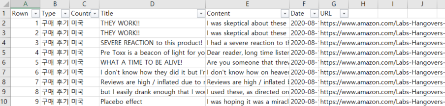

# **_Natural-Language-Processing-Analysis_**

---

## **Amazon Review Analysis**

- Amazon 숙취해소제 제품의 리뷰 데이터 분석
- 아주 basic한 전처리와 단어 빈도수 확인
- 제품에 대한 감성분석 진행

#### FOLDER [Amazon_Review_Analysis](./Amazon_Review_Analysis)  
#### DATA : 20200828 amazon_review.xlsx

> [Word Cleaning](./Amazon_Review_Analysis/amazon_review1_word_cleaning.ipynb) : Text Preprocessing  
> [Word Count](./Amazon_Review_Analysis/amazon_review2_top50.ipynb) : Word Count Top50  
> [Sentiment Analysis1](./Amazon_Review_Analysis/amazon_review3_TitleTokenizer.ipynb)  
> [Sentiment Analysis2](./Amazon_Review_Analysis/amazon_review4_ContentTokenizer.ipynb)

---

## **Spooky Author Identification**

- Kaggle 과제 : https://www.kaggle.com/c/spooky-author-identification
